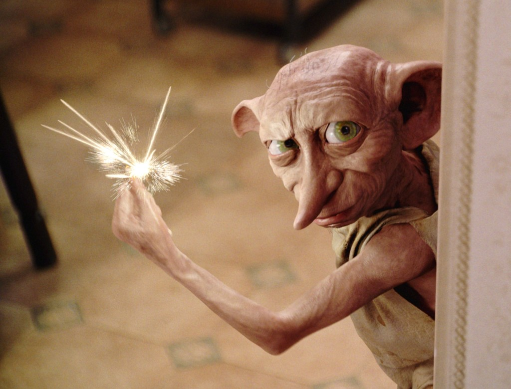

# dobby


dobby, is the free elf (sublime text 3 plugin) which converts markdown to emoji in the editor itself with a snap. :rocket:

### Usage :keyboard:

You can add emojis to your code as 
```
:smile: :balloon: :small_airplane:
```
and dobby converts them to emojis using his snap, in the editor itself

:smile: :balloon: :small_airplane:

### Setup :nut_and_bolt:

- You need to have the latest version of sublime-text-3 installed on your machine. Please get it from [here]().
- Go to the Packages folder of the sublime-text-3 application.
	```
	$ cd ~/.config/sublime-text-3/Packages/
	```
- Clone this repository here.
	```
	git clone https://github.com/vchrombie/dobby
	``` 
- Add this entry to your list of keybindings: (Sublime Text > Preferences > Key Bindings)
	```
	{ "keys": [ "ctrl+m"], "command": "dobby" }
	```
- That's it, you are now ready to use dobby :tada:. Type the code and use the shortcut (ctrl+m), the dobby's snap. :wink:

**Want to dicuss something** :speech_balloon:

Feel free to raise an issue, if you are having any doubt or you have any sugesstions for improving the plugin.  

### Acknowledgments :blue_heart:
- [Dobby](https://harrypotter.fandom.com/wiki/Dobby)
- [Create Sublime Text 3 Packages](https://cnpagency.com/blog/creating-sublime-text-3-plugins-part-1/)
- [GithHub API | Emojis](https://api.github.com/emojis)
- [jzeferino/AllGithubEmojis](https://github.com/jzeferino/AllGithubEmojis/)